# NP Reduction Visualizer

A Python-based interactive visualizer for NP-complete problem reductions. This tool provides dynamic visualizations of problem instances and their corresponding reductions, such as 3SAT → Independent Set and 3SAT → 3-Coloring. For detailed documentation, see Documentation.pdf in the repository. 

## 📦 Installation

### Requirements
- Python 3.12+
- `numpy`
- `pygame`

### Clone the Repository
```bash
git clone git@github.com:wuwendyy/NP-reduction-visualization.git
cd NP-reduction-visualization
```

### (Optional) Setup with Anaconda
```bash
conda create -n npvis python=3.12
conda activate npvis
```

### Install Dependencies
```bash
pip install -e .
```

## 🚀 Running Example Programs

### 3SAT → Independent Set
Run:
```bash
python -m tests.reduction_test.test_3sat_to_is
```

A window will open showing:
- **Left:** 3SAT problem
- **Right:** Independent Set problem

Clicking an element in either panel highlights corresponding elements in the other. Press `S` to toggle solution visualization using color groups.

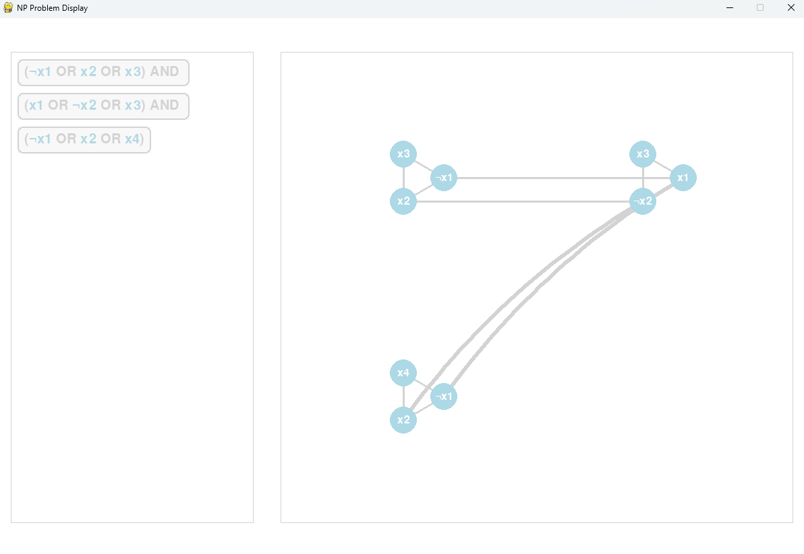
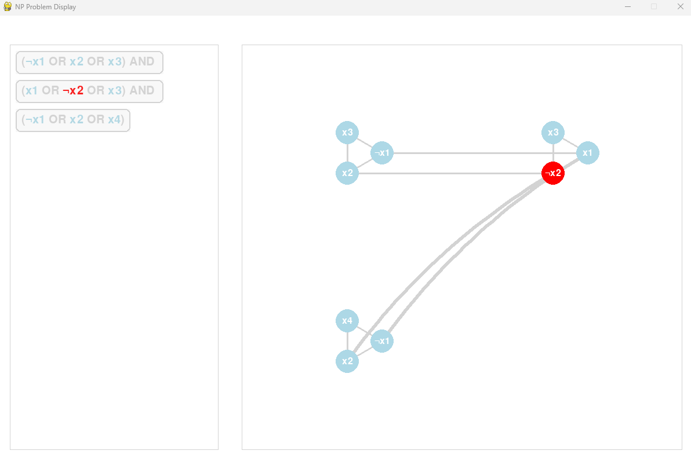
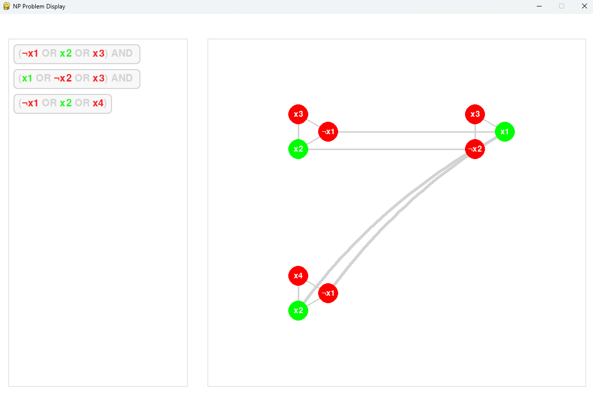

---

### 3SAT → 3Coloring
Run:
```bash
python -m tests.reduction_test.test_3color_to_3sat
```

This visualizer allows multiple elements in the 3Color panel to correspond to one 3SAT clause. The more elements you select, the brighter the clause's highlight.

| 3 Elements Selected | 6 Elements Selected |
|---------------------|---------------------|
| 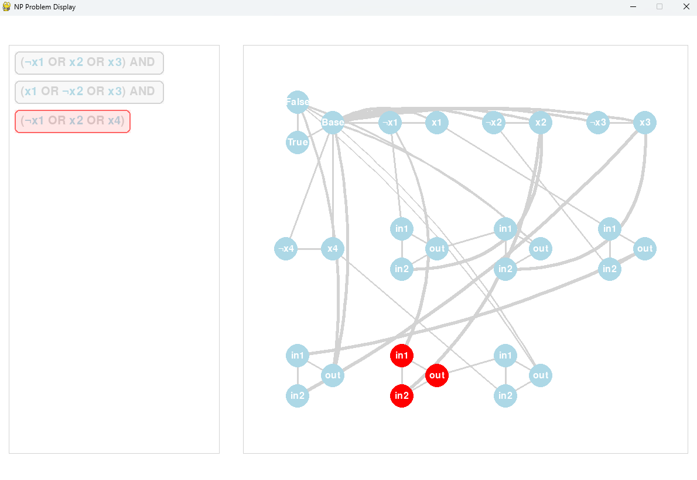 | 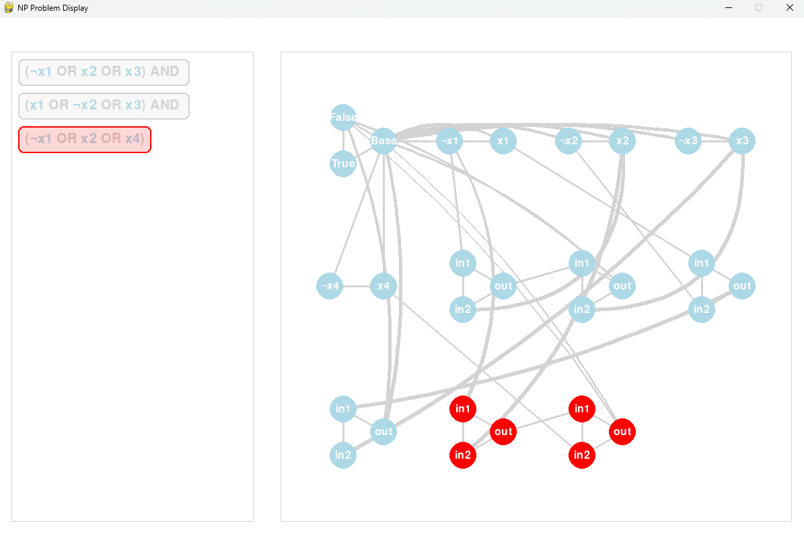 |

---

## 🧩 Core Classes

### Element and SubElement
- `Element`: Abstract class with methods `parse()`, `display()`, and `handle_event()`.
- `SubElement`: Abstract class used for core visual components such as nodes, edges, variables, and clauses.

#### Node
Displayed as a circle with:
- `id`, `name`, `location`, `neighbors`, and visual states.
- Can be toggled for highlighting and display neighbors.

#### Edge
Connects two nodes with highlighting behavior.

#### Variable and Clause
Used in SAT formulas, supporting logical evaluation and color-based visualization.

---

### Graph
Encapsulates visual representation of nodes and edges. 
Supports grouped node layouts and collision avoidance.

**Input Format (TXT):**
```
X1
X2
...
(X1, X2)
...
[X1, X2, X4]
```

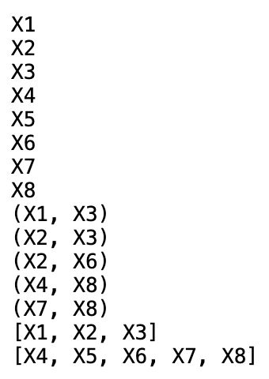

| Random Graph | Grouped Graph |
|--------------|---------------|
| 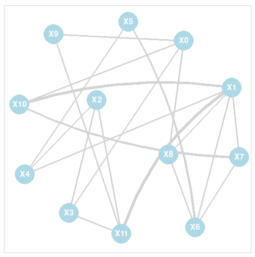 | 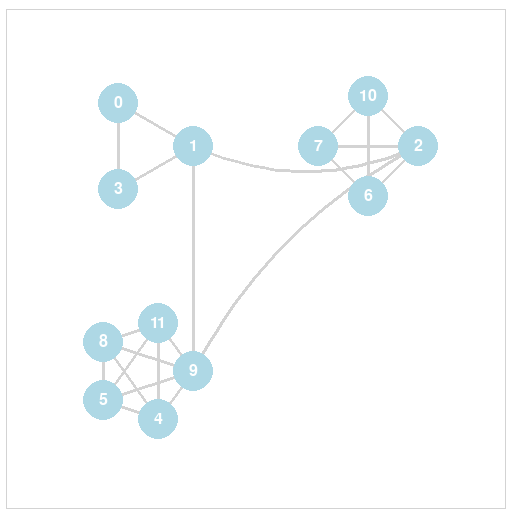 |

---

### Formula
Represents a 3SAT-style Boolean formula with text parsing and rendering.

**Input Format:**
- Literal expressions like `X1 OR NOT X2 OR X3` in specific syntax.

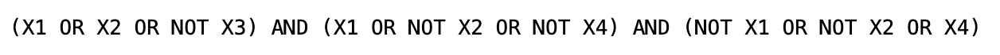

| Basic | Colored |
|-------|---------|
| 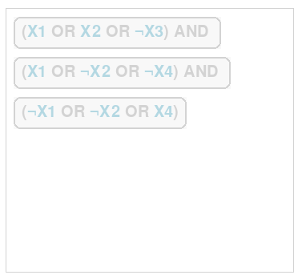 | 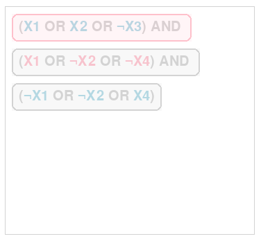 |

---

## 🔍 NP_Problem Classes

### IndependentSetProblem
Given a graph, verify if selected nodes form a valid independent set (no two connected). Supports evaluation and visual feedback.

| Default | With Solution |
|---------|----------------|
| 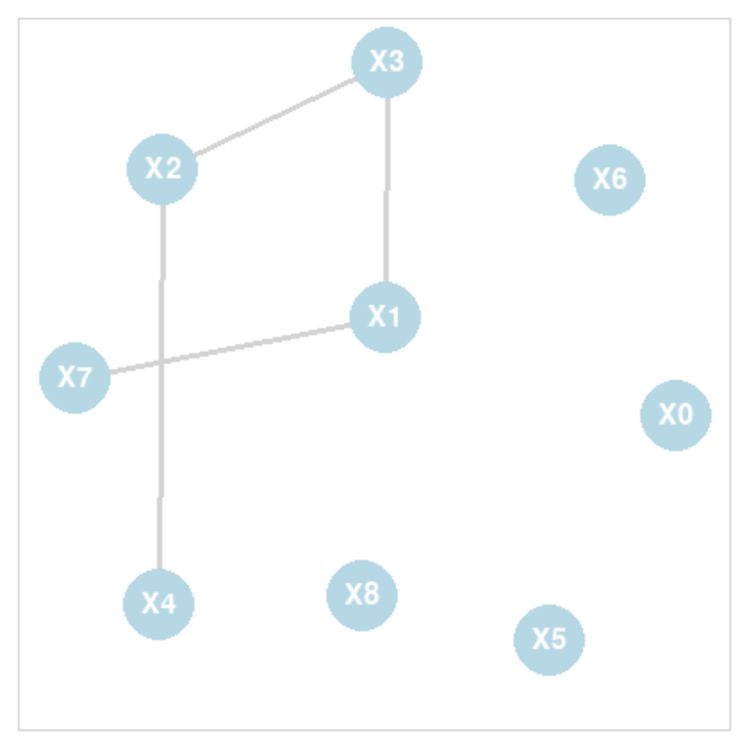 | 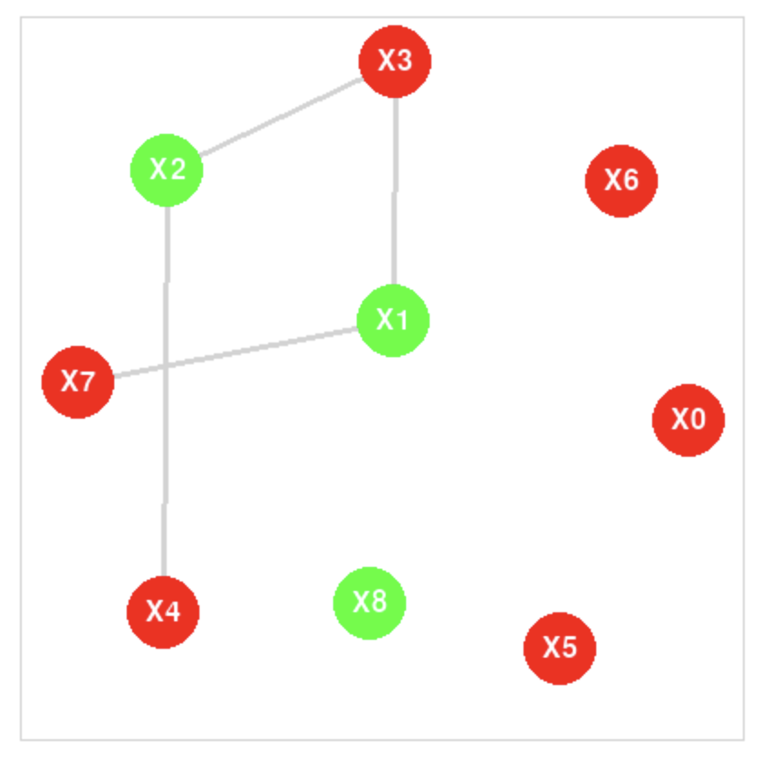 |

---

### ThreeSATProblem
Evaluates whether a Boolean formula with 3-literal clauses can be satisfied.

---

## 🛠 Development Notes

- Core visual logic powered by **Pygame**
- Modular architecture with reusable `Element` types
- Input files and visual styling defined clearly for extensibility
